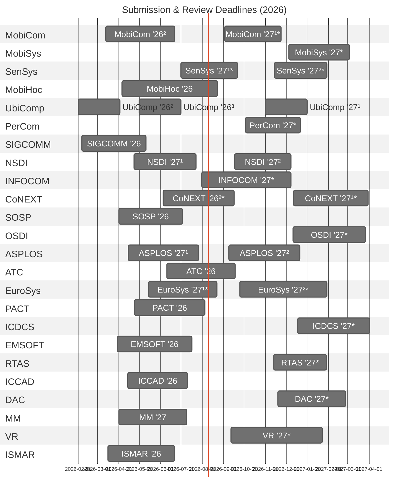

# 📱 Mobile Systems Conference Deadlines (2026)
Peer review timelines (submission → final notification) for major venues in Mobile / Networking / Systems / Embedded / Multimedia.
- `*`: Estimated schedule (CFP is not out yet)
- Duration: submission → final notification
- Last updated: 2026-02-13

### CFP Reference Table

| Conference | Submission | Final Notification | CFP Link |
|------------|------------|--------------------|----------|
| MobiCom '26² | 2026-03-13 | 2026-06-22 | https://www.sigmobile.org/mobicom/2026/cfp.html |
| MobiCom '27¹* | 2026-09-03 | 2026-11-24 |  |
| MobiSys '27* | 2026-12-05 | 2027-03-05 | https://www.sigmobile.org/mobisys/2026/call_for_papers/ |
| SenSys '27¹* | 2026-07-01 | 2026-09-20 |  |
| SenSys '27²* | 2026-11-14 | 2027-01-29 |  |
| MobiHoc '26 | 2026-04-06 | 2026-08-23 | https://www.sigmobile.org/mobihoc/2026/cfp.html |
| UbiComp '26² | 2026-02-01 | 2026-04-02 | https://dl.acm.org/journal/imwut/how-to-submit |
| UbiComp '26³ | 2026-05-01 | 2026-07-02 | https://dl.acm.org/journal/imwut/how-to-submit
| UbiComp '27¹ | 2026-11-01 | 2027-01-01 | https://dl.acm.org/journal/imwut/how-to-submit |
| PerCom '27* | 2026-10-03 | 2026-12-22 |  |
| SIGCOMM '26 | 2026-02-06 | 2026-05-11 | https://conferences.sigcomm.org/sigcomm/2026/cfp/ |
| NSDI '27¹ | 2026-04-23 | 2026-07-23 | https://www.usenix.org/conference/nsdi27/call-for-papers |
| NSDI '27² | 2026-09-17 | 2026-12-08 | https://www.usenix.org/conference/nsdi27/call-for-papers |
| INFOCOM '27* | 2026-07-31 | 2026-12-08 |  |
| CoNEXT '27¹* | 2026-12-12 | 2027-04-05 |  |
| CoNEXT '26²* | 2026-06-05 | 2026-09-15 |  |
| SOSP '26 | 2026-04-01 | 2026-07-03 | https://sigops.org/s/conferences/sosp/2026/cfp.html |
| OSDI '27* | 2026-12-11 | 2027-03-26 |  |
| ASPLOS '27¹ | 2026-04-15 | 2026-07-27 | https://www.asplos-conference.org/asplos2026/cfp.html |
| ASPLOS '27² | 2026-09-09 | 2026-12-21 | https://www.asplos-conference.org/asplos2026/cfp.html |
| ATC '26 | 2026-06-10 | 2026-09-18 | https://sigops.org/s/conferences/atc/2026/cfp.html |
| PACT '26* | 2026-04-20 | 2026-07-24 | https://pact2026.github.io/index |
| ICDCS '27* | 2026-12-18 | 2027-04-02 |  |
| EuroSys '27¹* | 2026-05-15 | 2026-08-22 |  |
| EuroSys '27²* | 2026-09-25 | 2027-01-30 |  |
| EMSOFT '26 | 2026-03-30 | 2026-07-17 | https://esweek.org/emsoft_cfp/ |
| RTAS '27* | 2026-11-13 | 2027-01-30 |  |
| ICCAD '26 | 2026-04-14 | 2026-07-11 | https://iccad.com/2026/authors/call-for-papers/ |
| DAC '27* | 2026-11-19 | 2027-02-28 |  |
| MM '27 | 2026-04-01 | 2026-07-09 | https://2026.acmmm.org/site/important-dates.html |
| VR '27* | 2026-09-12 | 2027-01-23 |  |
| ISMAR '26 | 2026-03-16 | 2026-06-22 | https://www.ieeeismar.net/2026/ |

### My Go-To Top CS Conference Lists
* [CSRankings](https://csrankings.org/)
* [Institutional Guidelines in South Korea (KIISE/NRF BK21+/Universities)](https://gist.github.com/Pusnow/6eb933355b5cb8d31ef1abcb3c3e1206)
